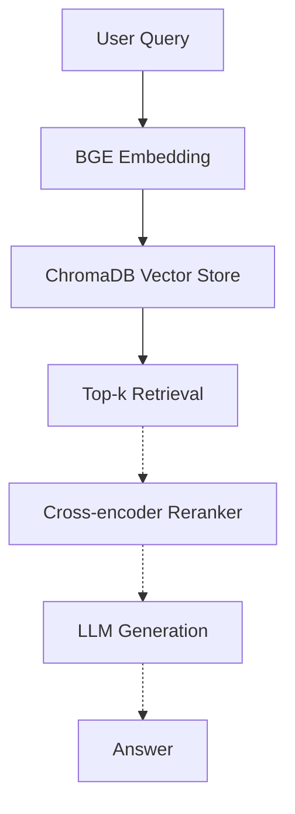

# RAG from Scratch · Multilingual E-commerce FAQ

A transparent, reproducible RAG pipeline built as an engineering counterpart to my research in multimodal learning and parameter-efficient tuning. Every component (chunking, embedding, vector store, retrieval) is explicit and inspectable — no framework magic.

**Status:** v1 (retrieval) — v2 (reranker + LLM generation) in progress.  
**Stack:** PyTorch 2.7 · LangChain · ChromaDB · BGE Embeddings · CUDA 12.8

---

## Motivation

Built while transitioning from academic research (Multimodal PEFT, AAAI 2026) toward LLM engineering. The goal is a RAG pipeline I can extend with reranking, generation, and evaluation — not a one-shot script glued together from tutorials.

**Domain choice:** cross-border e-commerce FAQ. Sample data covers Mandarin queries about refunds, shipping, and Indonesian local payment methods (OVO / DANA / GoPay), reflecting platforms like Shopee and Lazada.

---

## Architecture



Solid arrows = v1 (current). Dashed arrows = v2 (planned).
---

## Quick Start

**Requirements**
- Python 3.10+
- PyTorch 2.7 + CUDA 12.8 (tested on RTX 5090)
- ~2 GB GPU memory for BGE-small

**Install & Run**
```bash
pip install -r requirements.txt
python rag_demo.py
```

The script will:
1. Load 16 multilingual FAQ entries (refunds, shipping, payments, accounts)
2. Chunk with `RecursiveCharacterTextSplitter` (size=200, overlap=20)
3. Embed using `BAAI/bge-small-zh-v1.5` on GPU
4. Persist to a local ChromaDB index (`./chroma_db`)
5. Run 5 test queries and print top-k retrieved chunks with similarity scores

---

## Sample Output

```
Query: 我要退货
============================================================
[Top 1] Similarity: 0.7234
Category: 退款
Content: 问题：已发货能退款吗
         答案：已发货商品需先签收，然后申请'退货退款'...
```

---

## Performance Notes (v1)

| Item | Value |
| :--- | :--- |
| Corpus size | 16 documents → ~20 chunks |
| Embedding model | BGE-small-zh-v1.5 (24 MB, 512-dim) |
| Indexing time | < 5 s on RTX 5090 |
| Query latency | < 50 ms (warm) |
| Retrieval quality | qualitative for v1 — MRR / Recall@k benchmarks coming in v2 |

> v1 prioritizes correctness and clarity. Quantitative evaluation on a held-out query set is part of the v2 plan.

---

## Roadmap

- [x] **v1** — Retrieval with BGE + ChromaDB
- [x] **v2** — Cross-encoder reranker (`bge-reranker-base` via sentence-transformers)
- [ ] **v2** — LLM generation layer (Qwen2.5 / DeepSeek)
- [ ] **v2** — Evaluation harness (Recall@k, MRR, LLM-as-judge)
- [ ] **v3** — Multilingual eval set (Bahasa Indonesia queries)
- [ ] **v3** — Hybrid retrieval (BM25 + dense)

---

## License

MIT