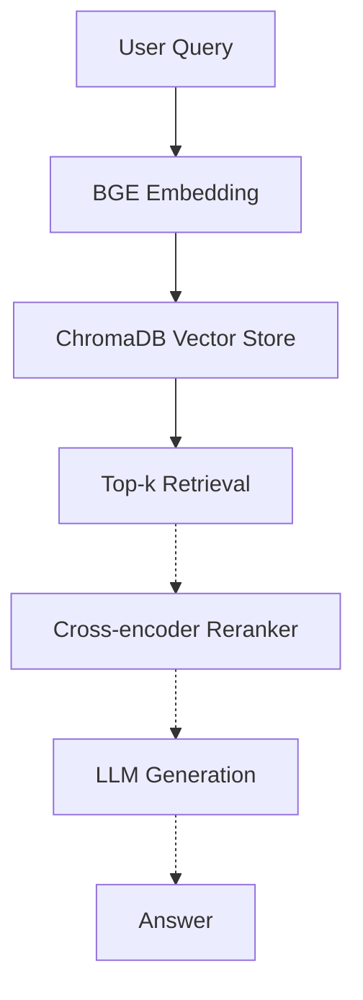

# RAG from Scratch · Multilingual E-commerce FAQ

A transparent, reproducible RAG pipeline built as an engineering counterpart to my research in multimodal learning and parameter-efficient tuning. Every component (chunking, embedding, vector store, retrieval) is explicit and inspectable — no framework magic.

**Status:** v2 (reranker + LLM + eval harness) — v3 (multilingual + hybrid) planned.  
**Stack:** PyTorch 2.7 · LangChain · ChromaDB · BGE Embeddings · CUDA 12.8

---

## Motivation

Built while transitioning from academic research (Multimodal PEFT, AAAI 2026) toward LLM engineering. The goal is a RAG pipeline I can extend with reranking, generation, and evaluation — not a one-shot script glued together from tutorials.

**Domain choice:** cross-border e-commerce FAQ. Sample data covers Mandarin queries about refunds, shipping, and Indonesian local payment methods (OVO / DANA / GoPay), reflecting platforms like Shopee and Lazada.

---

## Architecture



Solid arrows = v1 (current). Dashed arrows = v2 (planned).
---

## Quick Start

**Requirements**
- Python 3.10+
- PyTorch 2.7 + CUDA 12.8 (tested on RTX 5090)
- ~2 GB GPU memory for BGE-small

**Install & Run**
```bash
pip install -r requirements.txt
python rag_demo.py
```

The script will:
1. Load 16 multilingual FAQ entries (refunds, shipping, payments, accounts)
2. Chunk with `RecursiveCharacterTextSplitter` (size=200, overlap=20)
3. Embed using `BAAI/bge-small-zh-v1.5` on GPU
4. Persist to a local ChromaDB index (`./chroma_db`)
5. Run 5 test queries and print top-k retrieved chunks with similarity scores

---

## Sample Output

```
Query: 我要退货
============================================================
[Top 1] Similarity: 0.7234
Category: 退款
Content: 问题：已发货能退款吗
         答案：已发货商品需先签收，然后申请'退货退款'...
```

---

## Performance

### Retrieval (BGE + reranker)
| Item | Value |
| :--- | :--- |
| Corpus | 16 docs -> ~20 chunks |
| Embedding | BGE-small-zh-v1.5 (24 MB, 512-dim) |
| Reranker | bge-reranker-base (cross-encoder, ~280 MB) |
| Indexing | < 5 s |
| Retrieval latency | < 50 ms (warm) |

### LLM Generation (vLLM on RTX 4090)
Qwen2.5-7B-Instruct served by vLLM 0.10.0, `gpu_memory_utilization=0.85`, `max_model_len=4096`.

| Metric | Single query | 10 concurrent |
| :--- | :--- | :--- |
| Latency (avg) | 1232 ms | 1697 ms (wall) |
| Latency (P95) | 1588 ms | -- |
| Per-query throughput | 62.6 tokens/s | -- |
| **Aggregate throughput** | -- | **456 tokens/s** |
| **QPS** | 0.81 | **5.89** |

**Continuous batching speedup**: 10 concurrent queries finish in only ~1.4x the time of a single query, yielding **~7.3x aggregate throughput** vs serial execution. This is the practical advantage of PagedAttention + dynamic batching over transformers single-threaded inference.

See `benchmark.py` for reproduction.

### Evaluation harness (M3)

End-to-end evaluation on a 95-query benchmark (80 rewritten queries across 5 perturbation types + 15 hard negatives).

| Metric | Embedding | +Reranker |
| :--- | :--- | :--- |
| Recall@1 | 91.2% | **93.8%** |
| Recall@3 | 98.8% | **100.0%** |
| Recall@5 | 98.8% | **100.0%** |
| MRR@16 | 0.945 | **0.967** |

**Rejection threshold = 0.15** (optimized via F1 sweep over 19 values from 0.05 to 0.50):

| Metric | Value |
| :--- | :--- |
| ans-F1 | **0.943** |
| False-reject rate | 6.2% |
| Miss-reject rate | 13.3% |

**LLM-as-judge** (Qwen2.5-7B self-eval, n=75 answerable queries):

| Dimension | Mean (1-5) | Median | % rated 5 |
| :--- | :--- | :--- | :--- |
| Correctness | 4.76 | 5 | 84% |
| Faithfulness | 4.89 | 5 | 95% |
| Relevance | 4.77 | 5 | 89% |

> Self-evaluation has confirmation bias. Production should use a stronger model (GPT-4o-mini or Claude) as independent judge.

See `eval/` for harness code and `eval/results/*.json` for raw outputs.

---

## Roadmap

- [x] **v1** — Retrieval with BGE + ChromaDB
- [x] **v2** — Cross-encoder reranker (`bge-reranker-base` via sentence-transformers)
- [x] **v2** — LLM generation layer (Qwen2.5-7B served by vLLM, server-client API, threshold rejection)
- [x] **v2** — Evaluation harness (Recall@k, MRR, LLM-as-judge) — see Performance section
- [ ] **v3** — Multilingual eval set (Bahasa Indonesia queries)
- [ ] **v3** — Hybrid retrieval (BM25 + dense)

---

## License

MIT